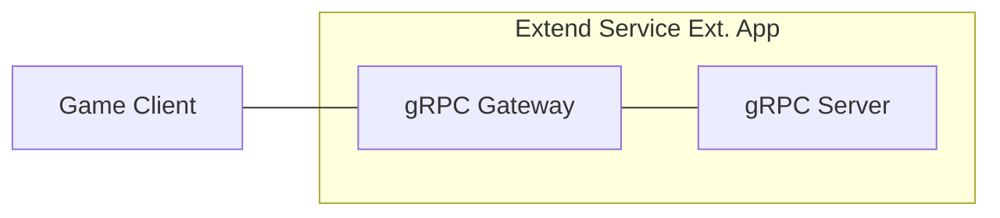
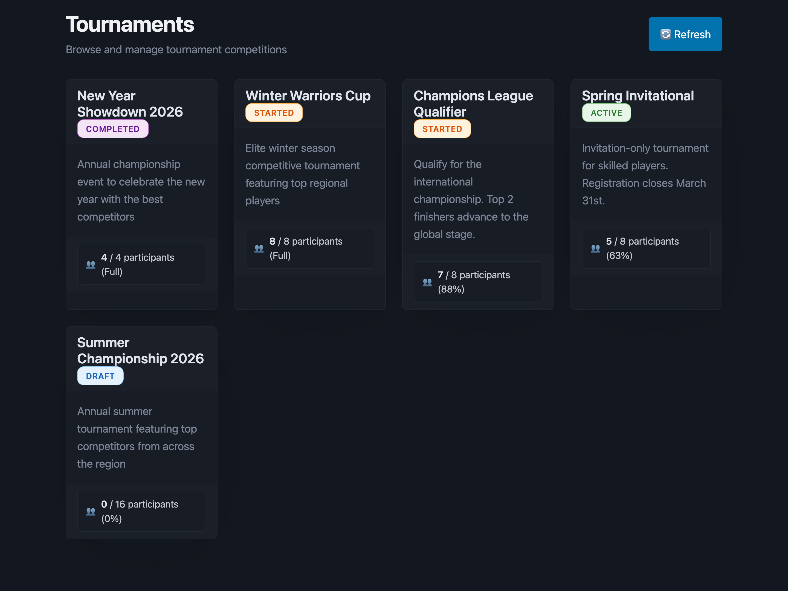
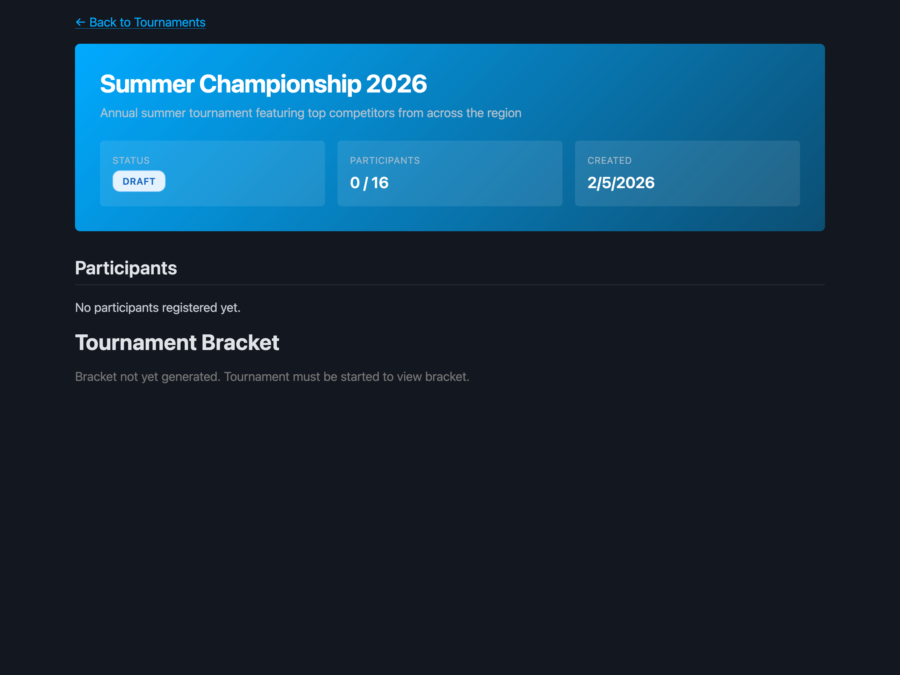
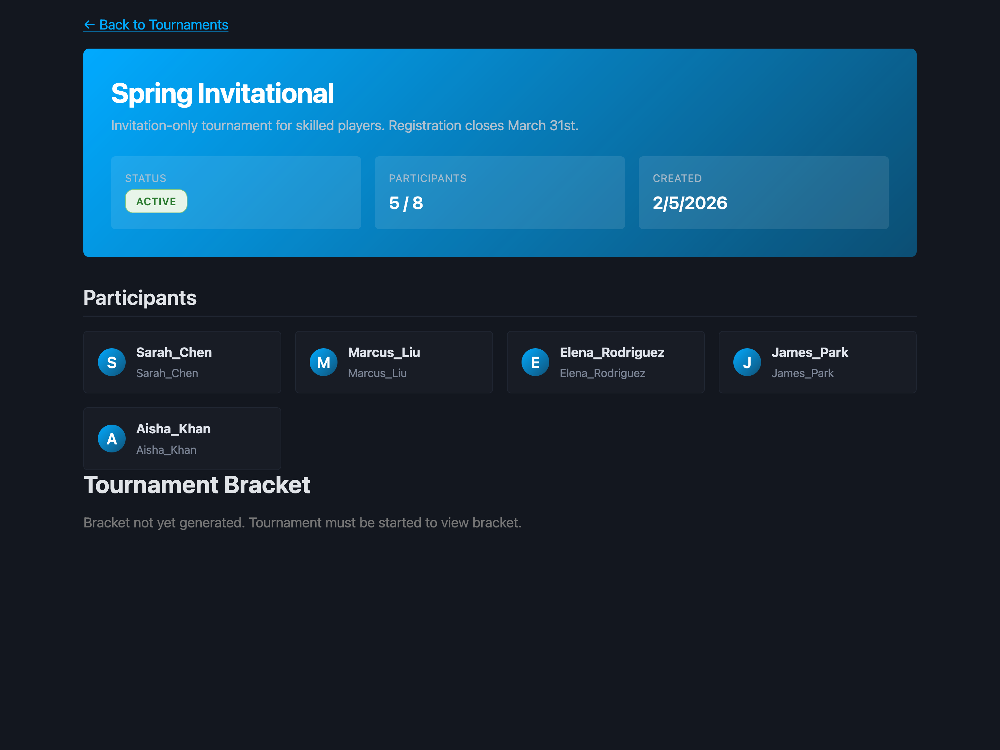
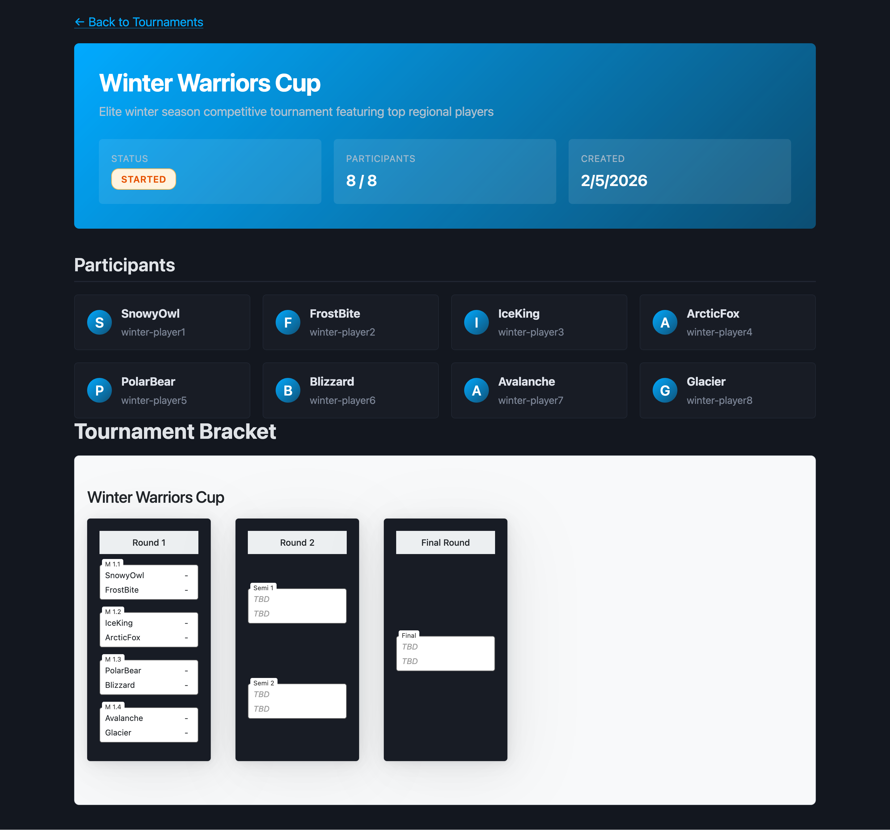
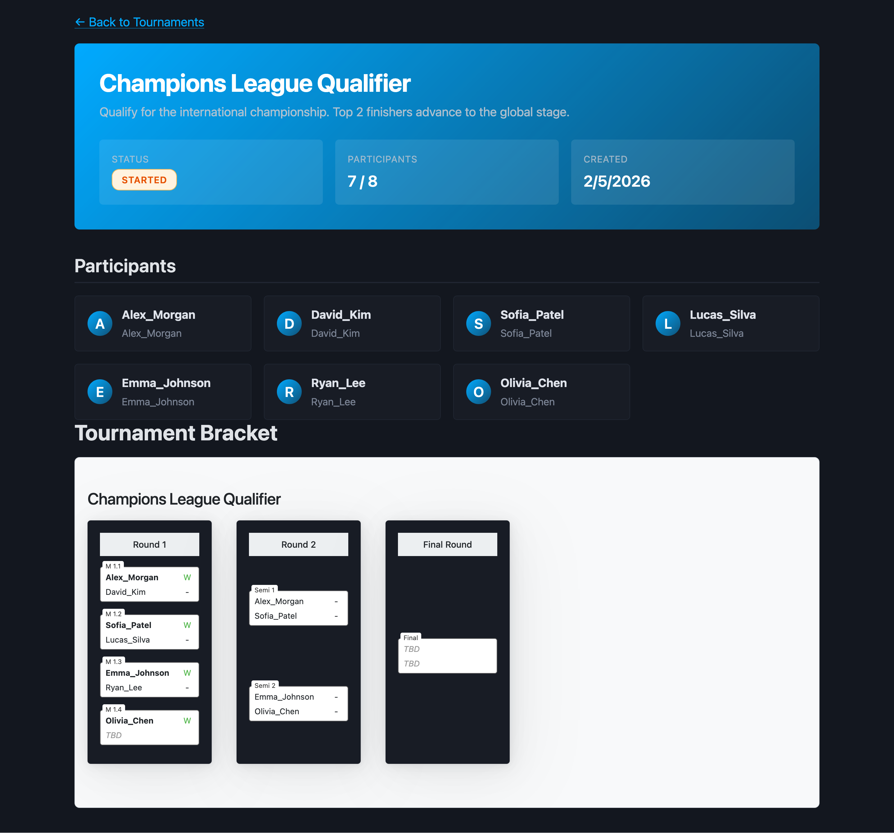
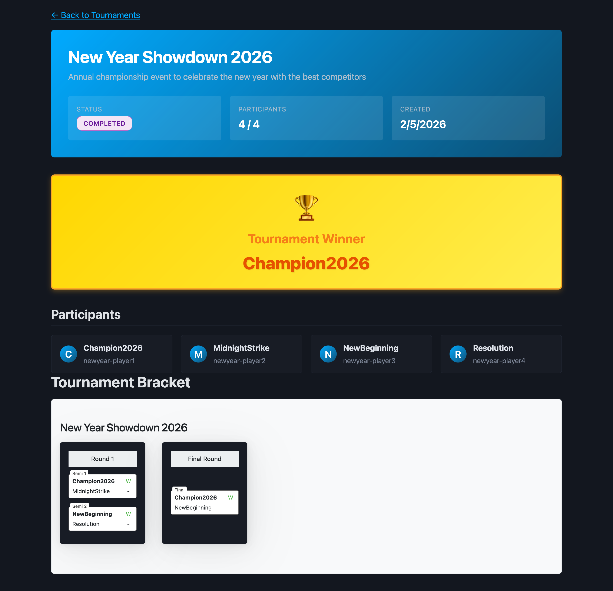
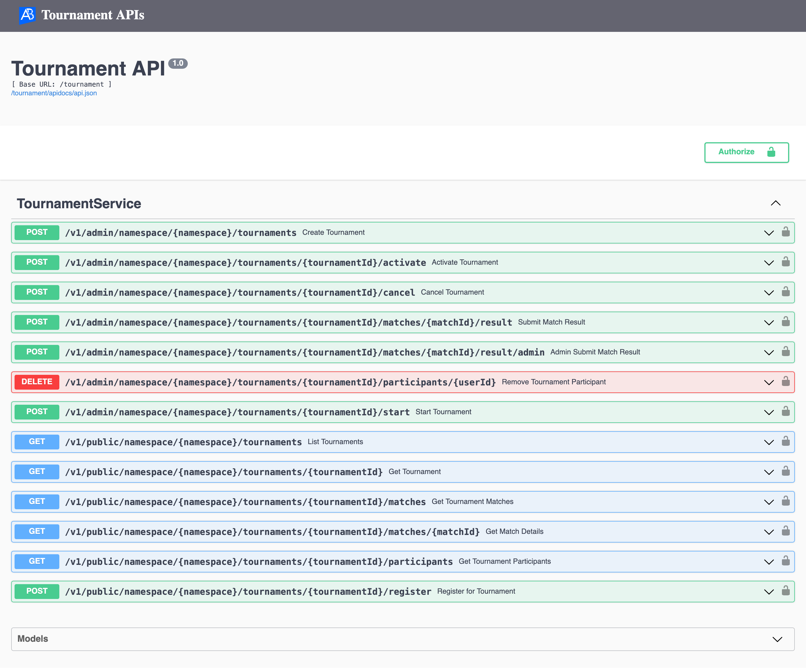
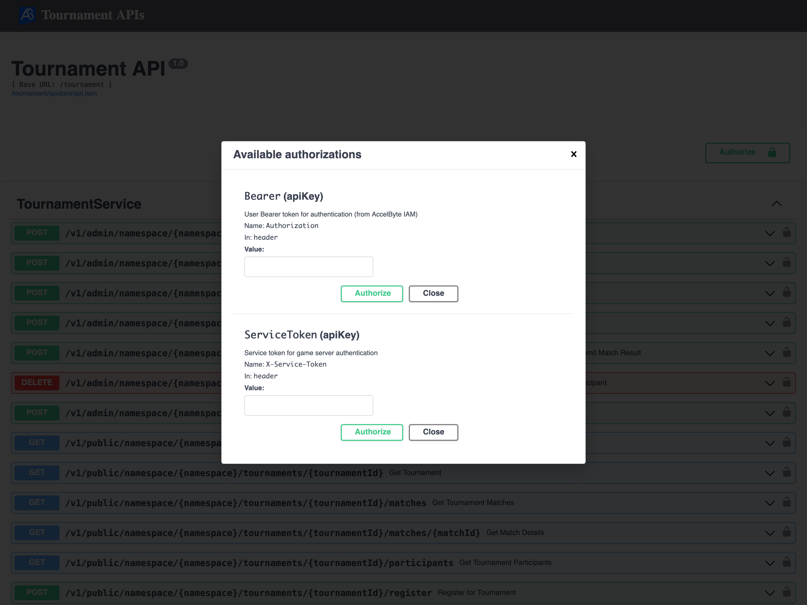

# Tournament Management Service

> **Built with AI assistance** - This project was developed in collaboration with Claude AI, showcasing modern AI-assisted development practices.



A production-ready tournament management system built as an `AccelByte Gaming Services` (AGS) Extend Service Extension. This service provides everything you need to run competitive tournaments in your game, from player registration to bracket generation and match result tracking.

## Overview

This is a complete tournament management solution that handles single-elimination brackets with automatic bracket generation, winner advancement, and real-time status tracking. Built on a modern stack using `gRPC` and `REST`, it integrates seamlessly with AccelByte's platform while providing a clean web interface for tournament visualization.

**Perfect for:** Esports events, ranked seasons, special competitions, community tournaments, and any competitive gaming scenario requiring structured bracket management.

## Features

### Tournament Lifecycle Management
- **Draft Mode** - Create and configure tournaments before opening registration
- **Active Registration** - Control when players can sign up for tournaments
- **Automatic Bracket Generation** - Single-elimination brackets with intelligent BYE handling
- **Real-time Match Tracking** - Monitor match progress and automatically advance winners
- **Tournament Completion** - Automatic status updates when finals conclude

### Smart Bracket System
- **Power-of-2 Optimization** - Efficient bracket structures for standard player counts (4, 8, 16, 32, etc.)
- **Non-Power-of-2 Support** - Automatic BYE placement for odd participant counts (5, 7, 13 players, etc.)
- **Explicit Match Relationships** - Clear winner advancement paths with O(1) lookup performance
- **Round Integrity** - Sequential round completion ensures fair play

### Admin & Player APIs
- **RESTful API** - Simple HTTP endpoints for all operations
- **gRPC Support** - High-performance gRPC for service-to-service communication
- **Role-Based Access** - Admin-only endpoints for tournament control, public endpoints for registration
- **OAuth2 Integration** - Secure authentication via AccelByte IAM

### Visual Tournament Interface
- **Live Bracket Visualization** - Beautiful bracket displays powered by [brackets-viewer.js](https://github.com/Drarig29/brackets-viewer.js)
- **Status Badges** - Color-coded tournament states (Draft, Active, Started, Completed)
- **Winner Highlighting** - Bold winners with green backgrounds, faded losers with strikethrough
- **Tournament Winner Banner** - Celebratory gold banner when tournaments complete
- **Responsive Design** - Clean, modern UI that works across devices

### Production Ready
- **MongoDB Persistence** - Reliable data storage with replica set support
- **OpenTelemetry Observability** - Built-in metrics, traces, and logs
- **Prometheus Metrics** - Monitor service health and performance (port 8080)
- **Swagger Documentation** - Interactive API docs at `/tournament/apidocs/`
- **Docker Deployment** - Containerized for easy deployment

## Screenshots

### Tournament List View
Browse all tournaments with status indicators and player counts:



### Tournament States

**Draft** - Tournament being configured:



**Active** - Players can register:



**Started** - Bracket generated, matches in progress:



**Ongoing** - Mid-tournament with some matches completed:



**Completed** - Winner crowned with celebratory banner:



## How It Works

### Tournament Lifecycle

```
1. CREATE → Tournament starts in DRAFT status
2. ACTIVATE → Opens for player registration (ACTIVE)
3. REGISTER → Players sign up until max capacity reached
4. START → Bracket generated, matches created (STARTED)
5. PLAY → Submit match results, winners advance automatically
6. COMPLETE → Final match determines champion (COMPLETED)
```

### Bracket Architecture

The system uses **explicit match relationships** for clear, maintainable bracket progression:

```go
Match {
  next_match_id       // Where does the winner go?
  source_match_1_id   // First feeder match
  source_match_2_id   // Second feeder match
}
```

This design ensures:
- **Fast lookups** - O(1) winner advancement instead of round iteration
- **Clear relationships** - Self-documenting bracket structure
- **Deterministic slots** - Winners always go to the correct participant slot
- **Future extensibility** - Easy to add double-elimination or Swiss formats

### Example: 4-Player Tournament

```
Round 1 (Semifinals):
  Match 1: Player A vs Player B → next_match_id: "final"
  Match 2: Player C vs Player D → next_match_id: "final"

Round 2 (Final):
  Match 3: TBD vs TBD
           source_match_1_id: "Match 1"
           source_match_2_id: "Match 2"
```

When Match 1 completes, the winner automatically advances to the Final's first slot. When Match 2 completes, the winner goes to the second slot. Simple and reliable.

## Project Structure

The codebase is organized for clarity and maintainability. Key components include the API definition layer (`proto`), business logic layer (`service`), persistence layer (`storage`), and web interface (`web`).

```shell
.
├── main.go                         # Application entry point
├── pkg
│   ├── common
│   │   ├── authServerInterceptor.go   # OAuth2 authentication
│   │   └── gateway.go                 # REST gateway setup
│   ├── pb                             # Generated gRPC code (auto-generated)
│   ├── proto
│   │   └── service.proto              # API definition (gRPC + REST)
│   ├── server
│   │   └── tournament.go              # gRPC handler delegation
│   ├── service
│   │   ├── tournament.go              # Tournament lifecycle logic
│   │   ├── participant.go             # Registration management
│   │   └── match.go                   # Bracket generation & results
│   ├── storage
│   │   ├── tournament.go              # Tournament persistence
│   │   ├── participant.go             # Participant persistence
│   │   └── match.go                   # Match persistence
│   └── ...
├── web
│   ├── templates                      # HTML pages
│   └── static                         # CSS, JS, assets
└── ...
```

**Key customization points:**
- `pkg/proto/service.proto` - Define your API endpoints
- `pkg/service/*.go` - Implement business logic
- `pkg/storage/*.go` - Database operations
- `web/` - Frontend interface

## Prerequisites

1. Windows 11 WSL2 or Linux Ubuntu 22.04 or macOS 14+ with the following tools installed:

   a. Bash

      - On Windows WSL2 or Linux Ubuntu:

         ```
         bash --version

         GNU bash, version 5.1.16(1)-release (x86_64-pc-linux-gnu)
         ...
         ```

      - On macOS:

         ```
         bash --version

         GNU bash, version 3.2.57(1)-release (arm64-apple-darwin23)
         ...
         ```

   b. Make

      - On Windows WSL2 or Linux Ubuntu:

         To install from the Ubuntu repository, run `sudo apt update && sudo apt install make`.

         ```
         make --version

         GNU Make 4.3
         ...
         ```

      - On macOS:

         ```
         make --version

         GNU Make 3.81
         ...
         ```

   c. Docker (Docker Desktop 4.30+/Docker Engine v23.0+)
   
      - On Linux Ubuntu:

         1. To install from the Ubuntu repository, run `sudo apt update && sudo apt install docker.io docker-buildx docker-compose-v2`.
         2. Add your user to the `docker` group: `sudo usermod -aG docker $USER`.
         3. Log out and log back in to allow the changes to take effect.

      - On Windows or macOS:

         Follow Docker's documentation on installing the Docker Desktop on [Windows](https://docs.docker.com/desktop/install/windows-install/) or [macOS](https://docs.docker.com/desktop/install/mac-install/).

         ```
         docker version

         ...
         Server: Docker Desktop
            Engine:
            Version:          24.0.5
         ...
         ```

   d. Go v1.24

      - Follow [Go's installation guide](https://go.dev/doc/install).

      ```
      go version

      go version go1.24.0 ...
      ```

   e. [Postman](https://www.postman.com/)

      - Use binary available [here](https://www.postman.com/downloads/)

   f. [extend-helper-cli](https://github.com/AccelByte/extend-helper-cli)

      - Use the available binary from [extend-helper-cli](https://github.com/AccelByte/extend-helper-cli/releases).

   > :exclamation: In macOS, you may use [Homebrew](https://brew.sh/) to easily install some of the tools above.

2. Access to AGS environment.

   a. Base URL:

      - Sample URL for AGS Shared Cloud customers: `https://spaceshooter.prod.gamingservices.accelbyte.io`
      - Sample URL for AGS Private Cloud customers:  `https://dev.accelbyte.io`

   b. [Create a Game Namespace](https://docs.accelbyte.io/gaming-services/services/access/reference/namespaces/manage-your-namespaces/) if you don't have one yet. Keep the `Namespace ID`. Make sure this namespace is in active status.

   c. [Create an OAuth Client](https://docs.accelbyte.io/gaming-services/services/access/authorization/manage-access-control-for-applications/#create-an-iam-client) with confidential client type with the following permissions. Keep the `Client ID` and `Client Secret`.

      - For AGS Private Cloud customers:
         - `ADMIN:ROLE [READ]` to validate access token and permissions
         - `ADMIN:NAMESPACE:{namespace}:NAMESPACE [READ]` to validate access namespace
      - For AGS Shared Cloud customers:
         - IAM -> Roles (Read)
         - Basic -> Namespace (Read)

   > :exclamation: **Note**: This service uses MongoDB for data persistence. No CloudSave permissions are required.
## Setup

To be able to run this app, you will need to follow these setup steps.

1. Create a docker compose `.env` file by copying the content of [.env.template](.env.template) file.

   > :warning: **The host OS environment variables have higher precedence compared to `.env` file variables**:
   > If the variables in `.env` file do not seem to take effect properly, check if there are host OS environment variables with the same name. 
   > See documentation about [docker compose environment variables precedence](https://docs.docker.com/compose/how-tos/environment-variables/envvars-precedence/) for more details.

2. Fill in the required environment variables in `.env` file as shown below.

   ```
   AB_BASE_URL='http://test.accelbyte.io'    # Your environment's domain Base URL
   AB_CLIENT_ID='xxxxxxxxxx'                 # Client ID from the Prerequisites section
   AB_CLIENT_SECRET='xxxxxxxxxx'             # Client Secret from the Prerequisites section
   AB_NAMESPACE='xxxxxxxxxx'                 # Namespace ID from the Prerequisites section
   PLUGIN_GRPC_SERVER_AUTH_ENABLED=true      # Enable or disable access token and permission validation
   BASE_PATH='/tournament'                   # The base path used for the app
   ```

   > :exclamation: **In this app, PLUGIN_GRPC_SERVER_AUTH_ENABLED is `true` by default**: If it is set to `false`, the endpoint `permission.action` and `permission.resource`  validation will be disabled and the endpoint can be accessed without a valid access token. This option is provided for development purpose only.

## Building

To build this app, use the following command.

```shell
make build
```

## Running

To (build and) run this app in a container, use the following command.

```shell
docker compose up --build
```

## Testing

### Test in Local Development Environment

This app can be tested locally through the Swagger UI.

1. Run this app by using the command below.

   ```shell
   docker compose up --build
   ```

2. If **PLUGIN_GRPC_SERVER_AUTH_ENABLED** is `true`: Get an access token to 
   be able to access the REST API service. 
   
   To get an access token, you can use [get-access-token.postman_collection.json](demo/get-access-token.postman_collection.json) in demo folder.
   Import the Postman collection to your Postman workspace and create a 
   Postman environment containing the following variables.

   - `AB_BASE_URL` For example, https://test.accelbyte.io
   - `AB_CLIENT_ID` A confidential IAM OAuth client ID
   - `AB_CLIENT_SECRET` The corresponding confidential IAM OAuth client secret
   - `AB_USERNAME` The username or e-mail of the user (for user token)
   - `AB_PASSWORD` The corresponding user password (for user token)

   Inside the postman collection, use `get-client-access-token` request to get client token or use `get-user-access-token` request to get user access token.

   > :info: When using client access token, make sure the IAM client has the required permissions listed in the Prerequisites section.
   
   > :info: When using user access token, make sure the user has a role which contains the required permissions listed in the Prerequisites section.

3. The REST API service can then be tested by opening Swagger UI at 
   `http://localhost:8000/tournament/apidocs/`. Use this to create an API request 
   to try the endpoints.
   
   > :info: Depending on the envar you set for `BASE_PATH`, the service will 
   have different service URL. This how it's the formatted 
   `http://localhost:8000/<base_path>`

   

   To authorize Swagger UI, click on "Authorize" button on right side.

   

   Popup will show, input "Bearer <user access token>" in `Value` field for 
   `Bearer (apiKey)`. Then click "Authorize" to save the user's access token.

### Test Observability

To be able to see the how the observability works in this template project in
local development environment, there are few things that need be setup before 
performing test.

1. Uncomment loki logging driver in [docker-compose.yaml](docker-compose.yaml)

   ```
    # logging:
    #   driver: loki
    #   options:
    #     loki-url: http://host.docker.internal:3100/loki/api/v1/push
    #     mode: non-blocking
    #     max-buffer-size: 4m
    #     loki-retries: "3"
   ```

   > :warning: **Make sure to install docker loki plugin beforehand**: Otherwise,
   this app will not be able to run. This is required so that container 
   logs can flow to the `loki` service within `grpc-plugin-dependencies` stack. 
   Use this command to install docker loki plugin: 
   `docker plugin install grafana/loki-docker-driver:latest --alias loki --grant-all-permissions`.

2. Clone and run [grpc-plugin-dependencies](https://github.com/AccelByte/grpc-plugin-dependencies) stack alongside this app. After this, Grafana 
will be accessible at http://localhost:3000.

   ```
   git clone https://github.com/AccelByte/grpc-plugin-dependencies.git
   cd grpc-plugin-dependencies
   docker compose up
   ```

   > :exclamation: More information about [grpc-plugin-dependencies](https://github.com/AccelByte/grpc-plugin-dependencies) is available [here](https://github.com/AccelByte/grpc-plugin-dependencies/blob/main/README.md).

3. Perform testing. For example, by following [Test in Local Development Environment](#test-in-local-development-environment).

## Deploying

After completing testing, the next step is to deploy your app to `AccelByte Gaming Services`.

1. **Create an Extend Service Extension app**

   If you do not already have one, create a new [Extend Service Extension App](https://docs.accelbyte.io/gaming-services/services/extend/service-extension/getting-started-service-extension/#create-the-extend-app).

   On the **App Detail** page, take note of the following values.
   - `Namespace`
   - `App Name`

   Under the **Environment Configuration** section, set the required secrets and/or variables.
   - Secrets
      - `AB_CLIENT_ID`
      - `AB_CLIENT_SECRET`

2. **Build and Push the Container Image**

   Use [extend-helper-cli](https://github.com/AccelByte/extend-helper-cli) to build and upload the container image.

   ```
   extend-helper-cli image-upload --login --namespace <namespace> --app <app-name> --image-tag v0.0.1
   ```

   > :warning: Run this command from your project directory. If you are in a different directory, add the `--work-dir <project-dir>` option to specify the correct path.

3. **Deploy the Image**
   
   On the **App Detail** page:
   - Click **Image Version History**
   - Select the image you just pushed
   - Click **Deploy Image**

## What's Next?

This tournament system is ready to use as-is, or you can customize it for your specific needs:

- **Use it directly** - Deploy and start running tournaments right away
- **Customize the UI** - Modify `web/templates` and `web/static` to match your game's branding
- **Add features** - Extend `pkg/proto/service.proto` to add new endpoints
- **Different bracket types** - The explicit match relationship design makes it easy to implement double-elimination or Swiss formats

For more information on customizing Extend Service Extension apps, see the [official documentation](https://docs.accelbyte.io/gaming-services/services/extend/service-extension/customize-service-extension-app/).

---

**Ready to go?** Follow the setup steps above and you'll have a full-featured tournament system running in minutes. Good luck with your tournaments!
